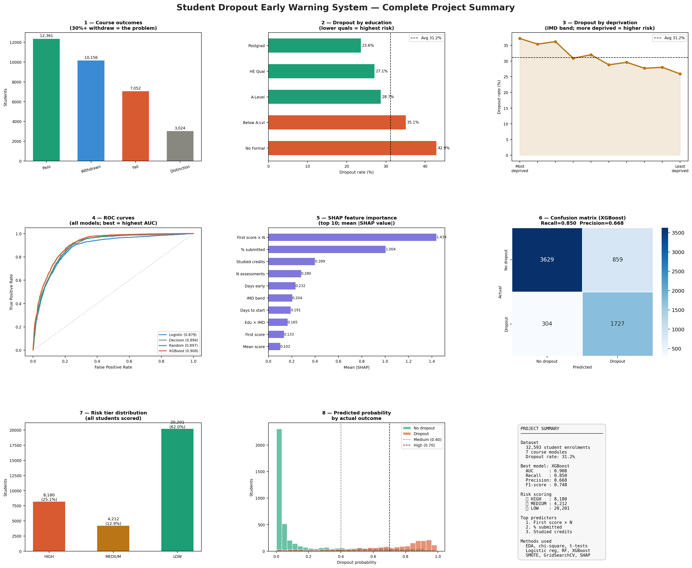

# Student Dropout Early Warning System

> **End-to-end data science project** — from raw educational data to
> a deployable machine learning model that predicts student dropout
> risk with personalised SHAP explanations.

---

## Project Overview

Student dropout is a critical challenge for higher education institutions.
This project builds a complete early warning system that:

1. **Identifies** students most likely to withdraw — before they do
2. **Ranks** them by risk level (HIGH / MEDIUM / LOW) so advisors can prioritise
3. **Explains** each student's risk score using SHAP values — not a black box

**Dataset:** Open University Learning Analytics Dataset (OULAD)
**Records:** 32,593 student-course enrolments across 7 modules
**Target:** Binary dropout (withdrew = 1, completed = 0) — 31.2% base rate

---

## Key Results

| Metric | Value |
|--------|-------|
| Best model | XGBoost |
| ROC-AUC | 0.908 |
| Recall (dropout detection rate) | 0.850 |
| F1-score | 0.748 |
| Students flagged HIGH risk | 8,180 of 32,593 (25.1%) |

The model correctly identifies **85.0% of students who will withdraw**
before they do, using data available within the first 4–6 weeks of term.

---

## Project Structure

```
student_dropout_project/
│
├── data/                          # OULAD CSV files (not included — see below)
│
├── outputs/
│   ├── phase2/block_*/            # EDA charts
│   ├── phase3/block_*/            # Statistical test outputs
│   ├── phase4/block_*/            # ML model outputs + risk scores
│   └── phase5/block_*/            # Final report and dashboard
│
├── phase1_load_inspect.py         # Data loading and quality checks
├── block_a_population.py          # EDA: population distributions
├── block_b_dropout_rates.py       # EDA: dropout rates by feature
├── block_c_correlation.py         # EDA: correlation analysis
├── block_d_timing.py              # EDA: when do students drop out?
├── block_e_summary.py             # Phase 2 summary report
├── phase3_block_a_chisquare.py    # Chi-square tests
├── phase3_block_b_ttests.py       # T-tests and ANOVA
├── phase3_block_c_logistic_regression.py  # Logistic regression
├── phase3_block_d_odds_ratios.py  # Odds ratios and forest plot
├── phase3_block_e_summary.py      # Phase 3 summary report
├── phase4_block_a_features.py     # Feature engineering pipeline
├── phase4_block_b_smote.py        # SMOTE class imbalance
├── phase4_block_c_model_training.py  # RF, XGBoost training
├── phase4_block_d_model_comparison.py # Evaluation
├── phase4_block_e_risk_scoring.py # Risk score table
├── phase4_block_f_shap.py         # SHAP explainability
├── phase5_block_a_executive_summary.py
├── phase5_block_b_recommendations.py
├── phase5_block_c_dashboard.py
└── phase5_block_d_portfolio_packaging.py
```

---

## Getting Started

### 1. Download the dataset

Visit [https://analyse.kmi.open.ac.uk/open_dataset](https://analyse.kmi.open.ac.uk/open_dataset),
download the zip, and extract the CSV files into the `data/` folder.

### 2. Install dependencies

```bash
pip install pandas numpy matplotlib seaborn scikit-learn xgboost shap imbalanced-learn statsmodels jupyter
```

### 3. Run the pipeline (in order)

```bash
# Phase 1 — Data loading
python phase1_load_inspect.py

# Phase 2 — EDA
python block_a_population.py
python block_b_dropout_rates.py
python block_c_correlation.py
python block_d_timing.py
python block_e_summary.py

# Phase 3 — Statistical analysis
python phase3_block_a_chisquare.py
python phase3_block_b_ttests.py
python phase3_block_c_logistic_regression.py
python phase3_block_d_odds_ratios.py
python phase3_block_e_summary.py

# Phase 4 — Machine learning
python phase4_block_a_features.py
python phase4_block_b_smote.py
python phase4_block_c_model_training.py
python phase4_block_d_model_comparison.py
python phase4_block_e_risk_scoring.py
python phase4_block_f_shap.py

# Phase 5 — Insights report
python phase5_block_a_executive_summary.py
python phase5_block_b_recommendations.py
python phase5_block_c_dashboard.py
python phase5_block_d_portfolio_packaging.py
```

---

## Methodology

### Phase 1 — Data acquisition
Loaded and sanity-checked all 5 OULAD tables. Identified missing
values (primarily `imd_band`, ~5%). Defined binary dropout target.

### Phase 2 — Exploratory data analysis
- Population distributions (7 demographic/academic features)
- Dropout rates by group — gender, age, education, deprivation, module
- Correlation heatmap and assessment score comparison
- Dropout timing analysis: 50% of dropouts leave by day 33

### Phase 3 — Statistical analysis
- **Chi-square tests** for all categorical features (with Cramér's V effect size)
- **Welch's t-tests** for numeric features (with Cohen's d)
- **Multivariate logistic regression** with p-values and CIs (statsmodels)
- **Odds ratios** and forest plot for interpretable risk quantification

### Phase 4 — Machine learning
- **Feature engineering**: 19 features including interaction terms and
  assessment timing variables
- **SMOTE**: synthetic oversampling of the minority class (training only)
- **Models**: Logistic Regression, Decision Tree, Random Forest, XGBoost
  with GridSearchCV hyperparameter tuning
- **Evaluation**: ROC-AUC, PR curves, CV-AUC, confusion matrices
- **Risk scoring**: probability + tier (HIGH/MEDIUM/LOW) for every student
- **SHAP**: global beeswarm, importance bar, dependence plots, and
  individual waterfall explanations

### Phase 5 — Insights and recommendations
- Executive summary (non-technical)
- 15 actionable recommendations across institution, educator, policy, and tech
- Priority action matrix (impact vs effort)
- 9-panel portfolio dashboard

---

## Skills Demonstrated

| Category | Tools / Techniques |
|----------|--------------------|
| Data wrangling | pandas, numpy, merging across 5 tables |
| EDA | matplotlib, seaborn, distribution plots, heatmaps |
| Statistics | scipy (chi-square, t-tests, ANOVA), statsmodels (logistic regression) |
| Machine learning | scikit-learn, XGBoost, GridSearchCV, SMOTE (imbalanced-learn) |
| Explainability | SHAP (TreeExplainer, waterfall, beeswarm, dependence plots) |
| Evaluation | ROC-AUC, PR curve, cross-validation, confusion matrix |
| Communication | Executive summary, recommendations, dashboard, README |

---

## Key Findings

1. **30%+ dropout rate** — widespread and unevenly distributed across modules
2. **Prior education is the strongest demographic predictor** — students with no
   formal qualifications drop out at nearly double the overall rate
3. **Assessment behaviour is the strongest early signal** — mean score, % submitted,
   and first assessment score outperform all demographic features
4. **Most dropouts happen early** — 50% withdraw in the first half of the course,
   creating a clear intervention window
5. **Socioeconomic deprivation compounds risk** — students from the most deprived
   areas face compounded disadvantage even after controlling for education level

---

## Project Dashboard



---

## Output Files

| File | Description |
|------|-------------|
| `outputs/phase4/block_e/E3_student_risk_scores.csv` | Full risk score table (32,593 students) |
| `outputs/phase4/block_e/E5_top20_highest_risk.csv` | Top 20 at-risk students |
| `outputs/phase5/block_a/phase5_executive_summary.txt` | Non-technical summary |
| `outputs/phase5/block_b/phase5_recommendations.txt` | 15 actionable recommendations |
| `outputs/phase5/block_c/phase5_dashboard.png` | 9-panel portfolio dashboard |

---

## Dataset Citation

Kuzilek J., Hlosta M., Zdrahal Z. Open University Learning Analytics dataset
Sci. Data 4:170171 doi: 10.1038/sdata.2017.171 (2017).

---

*Project completed: June 02, 2026*
